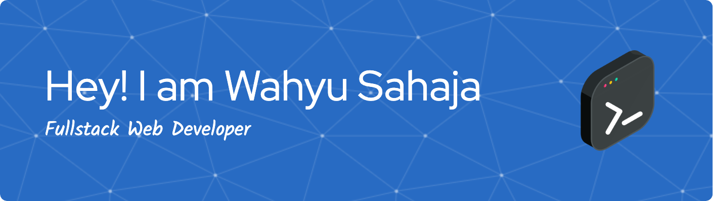

## Hi there! 👋

I’m a passionate Fullstack Web Developer with over **5 years of experience** in building stable, scalable, and user-oriented web applications. My expertise spans both frontend and backend technologies, and I enjoy turning complex problems into elegant solutions.

### About Me

- 💻 Love building web applications that are fast, scalable, and maintainable.
- 🤝 Comfortable working in agile environments and collaborating with cross-functional teams.

### Tech Stack
**Languages & Frameworks**

**Databases & Storage**

**Styling & UI**

**Tools & Others**

### Let's Connect

Feel free to explore my repositories and get in touch if you're interested in collaboration or just want to say hi!

---

_Thanks for visiting!_
